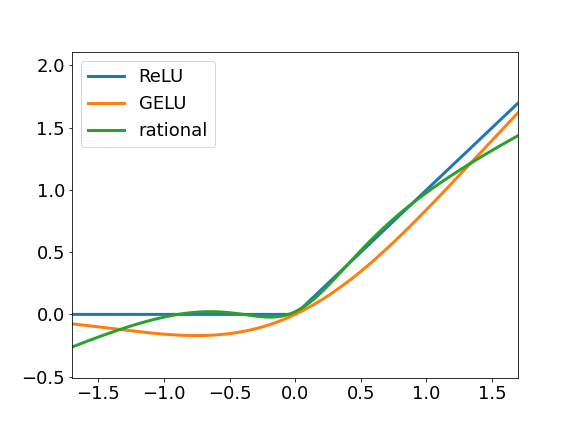

# rationalnets
JAX/Flax implementation of rational neural nets.



Original
- paper: Nicolas Boullé, Yuji Nakatsukasa, and Alex Townsend, [Rational neural networks](https://arxiv.org/abs/2004.01902), arXiv preprint arXiv:2004.01902 (2020).
- github: https://github.com/NBoulle/RationalNets


## Installation
`rationalnets` can be installed with pip with the following command:
```
python -m pip install rationalnets
```

Or you can install the latest version with the following command:
```
python -m pip install git+https://github.com/yonesuke/RationalNets.git
```

## QuickStart
Rational activation function
```python
import jax.numpy as jnp
from jax import random
from rationalnets import RationalMLP

xs = jnp.arange(-2.0, 2.0, 0.01)
act = Rational()
params = model.init(random.PRNGKey(0), xs)
ys = act.apply(params, xs) # values of rational activation function for -2.0 ~ 2.0
```

Rational MLP
```python
import jax.numpy as jnp
from jax import random
from rationalnets import RationalMLP

model = RationalMLP([12, 8, 4])
batch = jnp.ones((32, 10))
variables = model.init(random.PRNGKey(0), batch)
output = model.apply(variables, batch)
```
